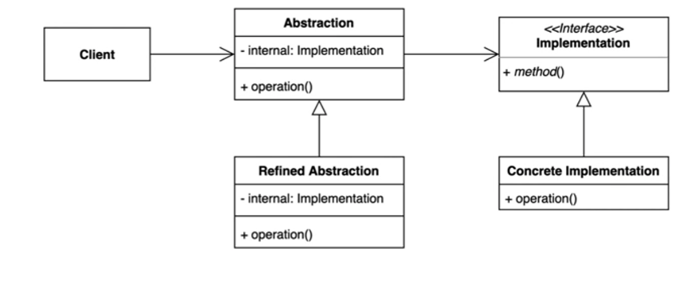

### 브릿지 (Bridge) 패턴
추상적인 것과 구체적인 것을 분리하여 연결하는 패턴

- 하나의 계층 구조일 때 보다 각기 나누었을 때 독립적인 계층 구조로 발전 시킬 수 있다.

연결하려면 상속이 아닌 컴포지션을 사용.
**추상적인 것들과 구체적인 것들을 나눠서 연결하는** 
구분짓는 것에 좀 더 집중 !

Abstraction -> Implementation 으로 이어주는 부분이 중요

### 특징

클라이언트는 Implementation 을 직접 사용하지 않고 Abstraction 같은 추상적인 계층 구조만 사용하고
Implementation 를 간접적으로 사용하게 된다.

무조건 추상 -> 인터페이스 vs 구체 -> 클래스가 아님.

### 장단점

- 장점
  - 추상적인 코드를 구체적인 코드 변경 없이도 독립적으로 확장할 수 있다.
  - 추상적인 코드와 구체적인 코드를 분리할 수 있다.
- 단점
  - 계층 구조가 늘어나 복잡도가 증가할 수 있다.

객체 지향 5원칙 중 ISP(인터페이스 분리 원릭), SRP(단일 책임 원칙) 두 원칙을 지킨다.

### 자바와 스프링에서 찾아보는 패턴
